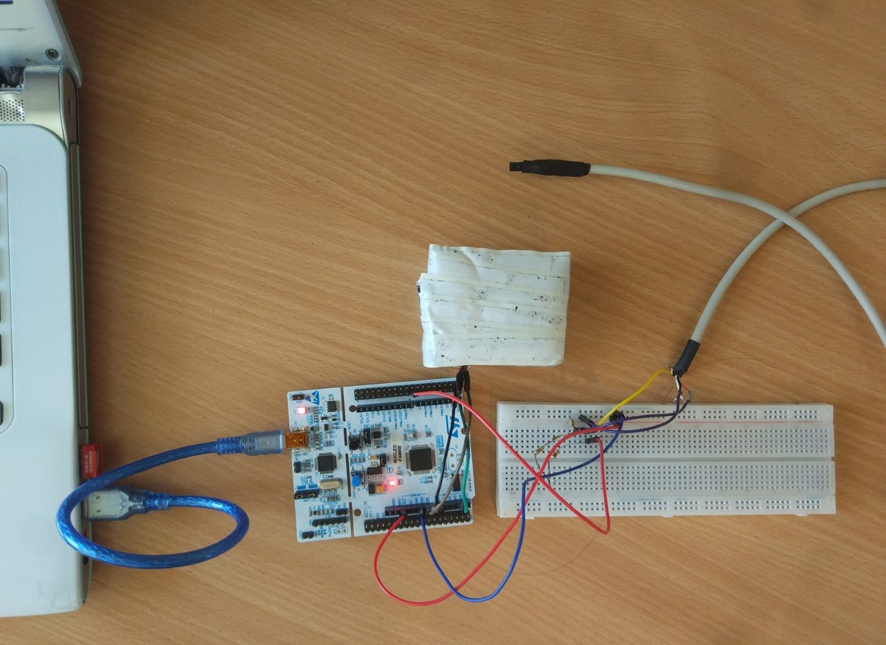
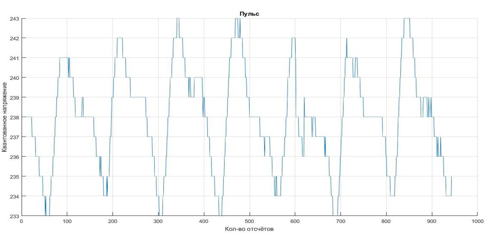

Thesis
==========================
This project is a diploma work of a BSU student. The project is the simplest system for collecting data from a person. The system collects temperature and heart rate data.

## Hardware
* DS18B20 Temperature Sensor
* heart rate monitor from aliexpress
* NUCLEO64 with STM32F446RE

## Appearance of the prototype

## Heart rate chart

